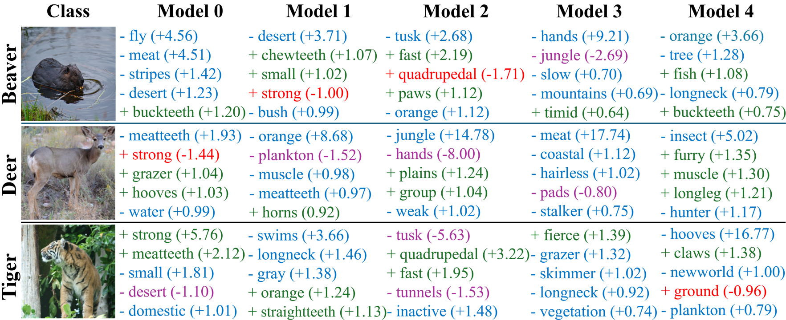

# Rashomon Concept Bottleneck Models

This repository contains the code for [**Exploring the Rashomon Set for Concept-Based Models**](https://arxiv.org/abs/2511.19636). It introduces a method for efficiently exploring the Rashomon set of CBMs and returns a set of accurate CBMs with different reasoning rationales.

<p align="center">
  
</p>
<p align="center">
  <em>Example qualitative analysis on AwA2: models in the Rashomon set can reach similar task performance while relying on different concepts.</em>
</p>

The code supports training our proposed method with two instantiations (ViT + LoRA and ResNet-18 + ConvAdapter), three baselines, downstream analyses such as task accuracy, concept diversity and SHAP similarity, and two use cases from the paper: reliable abstention and finding a fair model for free.

## Highlights

- Train a set of accurate CBMs with different reasoning rationales:
  - `random`: Independently initialized CBMs.
  - `DivEns`: Diverse Ensemble baseline adapted from the [diversified deep ensemble method](https://dl.acm.org/doi/10.5555/3495724.3497066).
  - `Dropout`: [Dropout-based Rashomon Set exploration](https://github.com/jpmorganchase/dropout-rashomon-set-exploration) baseline.
  - `Lora`: Our proposed method for exploring the Rashomon Slice (for ViT + LoRA instantiation).
  - `ConvAda`: Our proposed method for exploring the Rashomon Slice (for ResNet-18 + ConvAdapter instantiation).

- Evaluate task accuracy, concept accuracy, pairwise concept similarity and SHAP explanations similarity.
- Run use cases for reliable abstention and finding a fair model on CelebA without additional training.
- Supported datasets: CIFAR-10, CUB-200-2011, Animals with Attributes 2 (AwA2), CelebA, and HAM10000.
- Supported encoders: ResNet-18, ViT, and medical CLIP/ViT backbones.

## Installation

Create a Python environment, then install the dependencies:

```bash
conda create -n rashomon-cbm python=3.10 -y
conda activate rashomon-cbm
pip install -r requirements.txt
```

Install the PyTorch build that matches your CUDA version if the default wheel is not appropriate for your machine. For example:

```bash
pip install torch torchvision --index-url https://download.pytorch.org/whl/cu121
```

## Configuration

Set the project data root before running training or evaluation. The code resolves dataset paths as:

```text
BASE_DIR / data_dir / {train.pkl,val.pkl,test.pkl}
```

You can set `BASE_DIR` in either of two ways:

```bash
export RASHOMON_CBM_BASE_DIR=/path/to/data/root
```

or edit [config.py](config.py).

Weights & Biases logging is disabled by default. To use it, set `WANDB_ENABLE = True` in [config.py](config.py) and update `WANDB_PROJECT` / `WANDB_ENTITY`.

## Data Preparation

Each dataset module creates or expects processed split files:

```text
<BASE_DIR>/<DATA_DIR>/
├── train.pkl
├── val.pkl
└── test.pkl
```

The training script calls the relevant setup function before loading data. If the split files already exist, setup is skipped.

Common `data_dir` values used by the scripts:

| Dataset | `-dataname` | `-data_dir` | Concepts |
| --- | --- | --- | --- |
| CIFAR-10 | `cifar10` | `annotated_cifar10_processed` | 143 |
| CUB-200-2011 | `CUB` | `CUB_200_2011` | 112 |
| AwA2 | `Awa2` | `Awa2` | 85 |
| CelebA | `CelebA` | `CelebA` | 6 |
| HAM10000 | `HAM10000` | `HAM10000` | 139 |

Some dataset setup functions require local raw files or institution-specific download URLs. If automatic download is unavailable, place the raw dataset under the corresponding `data_dir` and rerun the script.

## Training

The main entry point is [train.py](train.py). A typical LoRA/adapter-style training command is:

Example:

```bash
python -u train.py \
  -exp Lora \
  -seed 1 \
  -log_dir runs/cifar10/Lora/seed1_encvit_m10_lambda1_alpha0.5-1.0_lr0.0001_wd0.0_mask000000000000_r8_la16 \
  -e 1000 \
  -pretrained \
  -data_dir annotated_cifar10_processed \
  -n_attributes 143 \
  -batch_size 32 \
  -weight_decay 0.0 \
  -lr 0.0001 \
  -scheduler_step 10 \
  -num_models 10 \
  -lambda_c_acc 1 \
  -dataname cifar10 \
  -encoder vit \
  -share_mask 000000000000 \
  --early_stop_metric mean_child_val_miscls \
  --lora_r 8 \
  --lora_alpha 16
```

For a script wrapper:

```bash
bash scripts/run.sh
```

The script exposes common sweep variables through the environment:

```bash
DRY_RUN=1 EXP_TYPE=Lora DATA_NAME=cifar10 bash scripts/run.sh
LR=0.0003 ALPHA_MIN=0.0 EXP_TYPE=Lora DATA_NAME=cifar10 bash scripts/run.sh
BOTTLENECK_DIM=32 EXP_TYPE=ConvAda DATA_NAME=CUB bash scripts/run.sh
```

The wrapper writes runs under `runs/<dataset>/<experiment>/...` by default. It only passes experiment-specific arguments when they are active: LoRA uses `LORA_MASK`, `LORA_R`, and `LORA_ALPHA`; `ConvAda` uses `ADAPTER_MASK` and `BOTTLENECK_DIM`; `Dropout` uses `DROP_RATE` and `PASSTHROUGH`.

### Important Training Arguments

| Argument | Description |
| --- | --- |
| `-exp` | Training variant: `DivEns`, `random`, `ConvAda`, `Lora`, or `Dropout`. |
| `-dataname` | Dataset key used to select the loader and class count. |
| `-data_dir` | Dataset folder under `BASE_DIR`. |
| `-n_attributes` | Number of concept attributes. |
| `-num_models` | Number of ensemble members. |
| `-lambda_c_acc` | Weight on concept prediction loss/diversity terms. |
| `-encoder` | Backbone: `vit` by default. `Lora` supports `vit` and `medical_vit`; `ConvAda` requires `resnet18`. |
| `-share_mask` | Adapter/LoRA sharing mask. LoRA uses a 12-bit transformer-block mask; `ConvAda` uses a 5-stage ResNet mask. `1` means shared and `0` means independent. |
| `--early_stop_metric` | Metric used to select `best_model.pth`. |
| `--resume --checkpoint_path <dir>` | Resume from checkpoint files in a previous log directory. |

## Evaluation

The basic evaluation entry point is [evaluation.py](evaluation.py). It expects a training log directory containing `best_model.pth`.

Example:

```bash
python -u evaluation.py \
  --task similarity \
  --exp Lora \
  --log_dir runs/cifar10/Lora/seed1_encvit_m10_lambda1_alpha0.5-1.0_lr0.0001_wd0.0_mask000000000000_r8_la16 \
  --data_dir annotated_cifar10_processed \
  --num_models 10 \
  --dataname cifar10 \
  --encoder vit \
  --share_mask 000000000000
```

Available tasks:

| Task | Output |
| --- | --- |
| `task_acc` | Re-evaluate task and concept accuracies. |
| `similarity` | Pairwise concept similarity analysis across child models. |
| `SHAP` | SHAP similarity analysis and top-concept reports. |

The wrapper script is:

```bash
LOG_DIR=runs/cifar10/Lora/seed1_encvit_m10_lambda1_alpha0.5-1.0_lr0.0001_wd0.0_mask000000000000_r8_la16 bash scripts/eval.sh
```

## Use Cases

The `experiments/` directory contains two downstream use cases built on the Rashomon Slice.

### Abstention

Compare it against the [original concept safeguard](https://arxiv.org/abs/2411.04342#:~:text=We%20propose%20a%20new%20approach%20to%20promote%20safety,by%20first%20predicting%20the%20presence%20of%20intermediate%20concepts.) and safeguard with random initialization.

Example:

```bash
python -u experiments/abstention.py \
  --log_dir <training_log_dir> \
  --dataname HAM10000 \
  --data_dir HAM10000 \
  --encoder vit \
  --out_dir abstention_results_HAM10000
```

The script also supports multi-run evaluation through `--runs_json`.

### Free Fair Model on CelebA

Obtain a model that satisfies a secondary trustworthy goal (e.g., fairness) for free from the Rashomon slice.

Example:

```bash
python -u experiments/fairness.py \
  --exp Lora \
  --log_dir <training_log_dir> \
  --data_dir <BASE_DIR>/CelebA \
  --num_models 10 \
  --encoder vit \
  --n_attributes 6 \
  --protected_attr Young \
  --target_attr Wavy_Hair
```

Shell wrappers are provided in `scripts/abstention.sh` and `scripts/fairness.sh`.

## Outputs

Each training run writes to `-log_dir`:

```text
<log_dir>/
├── log.txt
├── best_model.pth
├── checkpoint_model.pth
├── checkpoint_optimizer.pt
├── checkpoint_scheduler.pt
└── checkpoint_misc.pt
```

Evaluation and experiment scripts write text reports and CSV files either into the training log directory or the requested output directory.

## Slurm Sweeps

Use [scripts/job_submit.sh](scripts/job_submit.sh) to submit a small grid over learning rates and alpha values:

```bash
bash scripts/job_submit.sh --dry-run
bash scripts/job_submit.sh
```

Edit the grid values in the script before launching large sweeps.

## Citation

If you use this code, please cite the corresponding paper:

```bibtex
@article{feng2025many,
  title={Many Ways to be Right: Rashomon Sets for Concept-Based Neural Networks},
  author={Feng, Shihan and Zhang, Cheng and Xi, Michael and Hsu, Ethan and Semenova, Lesia and Zhong, Chudi},
  journal={arXiv preprint arXiv:2511.19636},
  year={2025}
}
```
